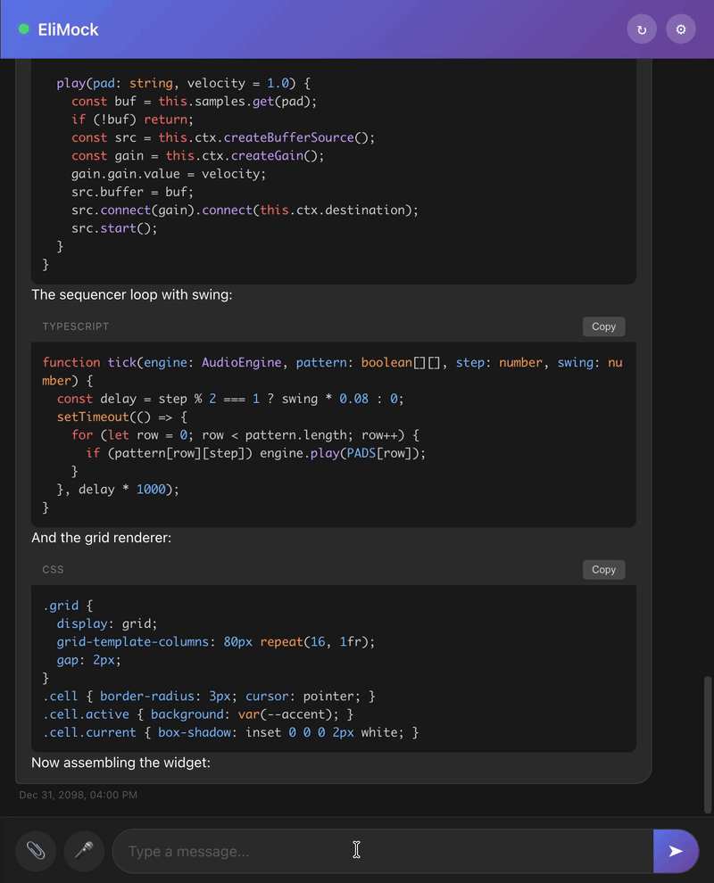

# Eliezer



A tiny, self-modifying AI agent. ~6K lines of TypeScript — small enough to fit in a context window, powerful enough to be useful.

Eliezer runs as a persistent background process. It talks to you through a chat interface, remembers conversations across sessions, works through task lists while you're away, and can edit its own source code. Bring your own LLM key — works with Anthropic, OpenAI, Kimi, Grok, DeepSeek, or any OpenAI-compatible provider.

## What it does

- Runs shell commands, reads/writes/edits files
- Searches the web, reads webpages (headless Chrome)
- Downloads files with automatic security vetting
- Manages scheduled jobs and persistent task lists
- Compresses old conversations to stay within context limits
- Explores codebases using a sub-agent
- Modifies its own code, restarts, and picks up where it left off

## Why it exists

Most agent frameworks are massive. Eliezer is the opposite — no abstractions, no plugins, no config DSLs. Just a main loop, some tools, and a database. The entire codebase fits in a context window many times over, so the agent can fully understand itself when it self-modifies. You can read it in an afternoon, then make it do whatever you want.

## Quick start

```bash
git clone https://github.com/Eliezer-app/eliezer.git
cd eliezer
cp .env.example .env    # add your LLM API key
make dev                # builds, starts SearXNG + Eliezer
```

Eliezer listens on port 3200. Pair it with [ClawChat](https://github.com/Eliezer-app/clawchat), a companion chat PWA with push notifications, interactive widgets, and mobile support.

```bash
make logs    # follow logs
make status  # memory stats and health
make shell   # shell into the container
make stop    # stop everything
```

## Configuration

All env vars in `.env`. No silent fallbacks — missing vars crash on startup.

| Variable | Description |
|----------|-------------|
| `LLM_PROVIDER` | `anthropic` or `openai` |
| `LLM_API_KEY` | Your API key |
| `LLM_BASE_URL` | API endpoint |
| `LLM_MODEL` | Model name |
| `CONTEXT_WINDOW` | Max tokens for the model |
| `SEARCH_URL` | SearXNG instance URL |
| `CHAT_URL` | Chat server URL |
| `USER_TZ` | Your timezone |

Use `COMPACTION_LLM_*` to run compaction on a cheaper model.

## Prompts

```
prompts/
  system.md       — agent identity and rules
  user.md         — user persona and preferences
  memory.md       — persistent scratchpad (agent-writable)
  compaction.md   — how to summarize conversations
  widgets.md      — widget/app building guidelines
```

Copied from `prompts-default/` on first run, gitignored. Yours to edit.

## Hacking

```bash
make test    # typecheck + integration tests (Docker)
make clean   # tear down everything
```

```
eliezer.mts      — main loop, tool dispatch
llm.mts          — LLM providers (Anthropic, OpenAI-compatible)
tools.mts        — exec, read, write, edit, wget, schedule, etc.
memory.mts       — conversation storage and context assembly
compaction.mts   — memory compaction engine
agent-tool.mts   — sub-agent framework
server.mts       — HTTP API
```

Adding a tool is ~30 lines: extend `ToolBase`, add it to the array in `eliezer.mts`.

## Links

[www.eliezer.app](https://www.eliezer.app)

## License

[MIT](LICENSE) — Victor Dramba
